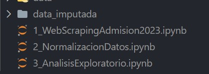

# Admisión 2023-II
El Examen de admisión de la UNMSM es muy competitivo y difícil. Esta es la Universidad mas  antigua de america y prestigiosas del Perú,  es conocida por su alto nivel académico.
En este proceso de admisión se presentaron 25832 y solo ingresaron ### los reultados los puedes ver  [aqui](https://admision.unmsm.edu.pe/WebsiteExa_20232/)


## Requisitos

Todas las librerias estan en el archivo requierements.txt y puede ejecutar el siguiente comando .

``` bash
pip install requierements.txt
```

## Uso
El proyecto esta guiado y documentado en el notebook ,las recomendaciones es que el enlace de los resultado de admisión caducan cada cierto tiempo , si lo quieres usar para analizar solo tienes que cambiar el url y el codigo seria el mismo.

## Autores
- [Jhon Velasque](https://www.linkedin.com/in/jhon-velasque-228093211/) (Data engineer)


### ESTRUCTURA
- Web scraping de la wed de la UNMSM
- Normalizacion de los datos optenidos
- Analisis exploratorio de los datos 

  
### ANALISIS EXPLORATORIO

--- 
- Actividades
  -Analisis Exploratorioa
    - top 5 carreras con mayor postulantes
    - su distribucion de las carreras con mayor puntaje
    - analisis de distribucion con boxplot de las carreras
    - el puntaje promedio por area
    - el puntaje promedio por area de los ingresantes
### CONCLUSIONES
--- 
- La carrera con mayor puntuje en este proceso de admision 2023 fue derecho con 1556.375	.
- Las carreras conmayor puntaje fueron derecho ,economia,comunicación social ,medicina humana ,genética .

- El puntaje promedio de los ingresantes es de 879.34.

- Las carrreras con mayor demanda no necesariamente son las carreras con mayor puntaje de ingreso.

- El area A ('ciencias de salud') tiene el mayor puntaje promedio .  

### RECOMENDACIONES
---
- Un postulante a medicina tendria que tener un puntaje de 1150 para que tenga mas probabilidades de ingreso.

- El postulante actualmente tiene la posibilidad de elegir cursos que tengan mas impacto en su respectiva area ya que solo necesita tesponder el 50% del examen correcto para ingresar

- Esta linea fue crada por vim

- creando codigo 
